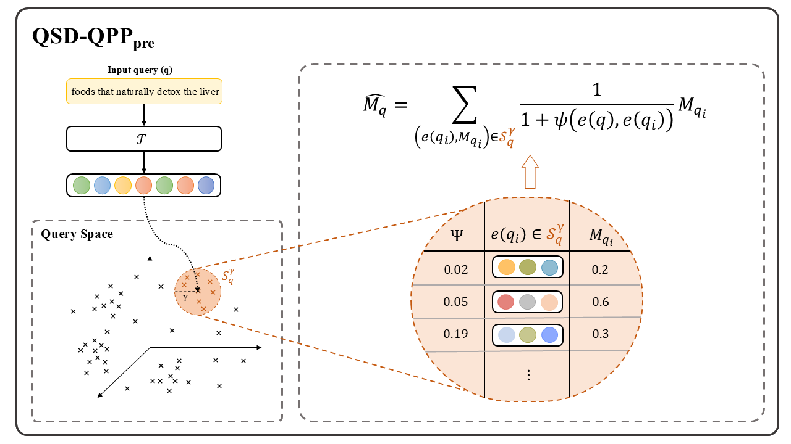
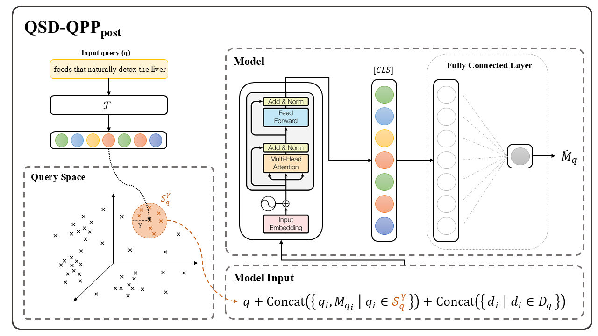

# Query Space Distance-Based (QPP): Estimating Query Performance based on Nearest Neighbors
This repository contains the implementation and the results of **Query Space Distance-Based Query Performance Prediction (QSD-QPP)**, a novel framework for estimating query performance by leveraging the deterministic behavior of retrieval methods. The QSD-QPP framework systematically constructs a high-dimensional Query Space to capture semantic and syntactic relationships between queries and their associated retrieval effectiveness.

This repository is organized as follows:
1. [QSD_QPP<sub>pre</sub>](#QSD_QPPpre): A lightweight pre-retrieval instantiation that predicts query performance by interpolating the effectiveness of proximate historical queries within the Query Space.
2. [QSD_QPP<sub>post</sub>](#QSD_QPPpost): An enriched post-retrieval instantiation that incorporates contextual embeddings, document interactions, and historical query associations for more accurate predictions.
3. [Usage](#Usage): Instructions on how to use the code to predict the performance of a set of target queries.
4. [Citation](#Citation): If you use this code, please cite our paper.


## QSD_QPP<sub>pre</sub>




### Performance Comparison with Baselines
The table below shows Pearson Rho, kendall Tau, and Spearman correlation of different baselines as well as our proposed NN-QPP method over four different datasets.

<table>
<thead>
  <tr>
    <th rowspan="2">QPP Method</th>
    <th colspan="3">MS MARCO Dev small (6980 queries)</th>
    <th colspan="3">TREC DL 2019 (43 Queries)</th>
    <th colspan="3">TREC DL 2020 (53 Queries)</th>
    <th colspan="3">DL Hard (50 Queries)</th>
  </tr>
  <tr>
    <th>Pearson Rho</th>
    <th>kendall Tau</th>
    <th>Spearman</th>
    <th>Pearson Rho</th>
    <th>kendall Tau</th>
    <th>Spearman</th>
    <th>Pearson Rho</th>
    <th>kendall Tau</th>
    <th>Spearman</th>
    <th>Pearson Rho</th>
    <th>kendall Tau</th>
    <th>Spearman</th>
  </tr>
</thead>
<tbody>
  <tr>
    <td>SCS</td>
    <td>0.021</td>
    <td>0.058</td>
    <td>0.085</td>
    <td>0.471</td>
    <td>0.262</td>
    <td>0.354</td>
    <td>0.447</td>
    <td>0.310</td>
    <td>0.448</td>
    <td>0.247</td>
    <td>0.159</td>
    <td>0.240</td>
  </tr>
  <tr>
    <td>P_Clarity</td>
    <td>0.052</td>
    <td>0.007</td>
    <td>0.009</td>
    <td>0.109</td>
    <td>0.119</td>
    <td>0.139</td>
    <td>0.069</td>
    <td>0.052</td>
    <td>0.063</td>
    <td>0.095</td>
    <td>0.209</td>
    <td>0.272</td>
  </tr>
  <tr>
    <td>VAR</td>
    <td>0.067</td>
    <td>0.081</td>
    <td>0.119</td>
    <td>0.290</td>
    <td>0.141</td>
    <td>0.187</td>
    <td>0.047</td>
    <td>0.051</td>
    <td>0.063</td>
    <td>0.023</td>
    <td>0.014</td>
    <td>0.001</td>
  </tr>
  <tr>
    <td>PMI</td>
    <td>0.030</td>
    <td>0.033</td>
    <td>0.048</td>
    <td>0.155</td>
    <td>0.065</td>
    <td>0.079</td>
    <td>0.021</td>
    <td>0.012</td>
    <td>0.003</td>
    <td>0.093</td>
    <td>0.027</td>
    <td>0.042</td>
  </tr>
  <tr>
    <td>IDF</td>
    <td>0.117</td>
    <td>0.138</td>
    <td>0.200</td>
    <td>0.440</td>
    <td>0.276</td>
    <td>0.389</td>
    <td>0.413</td>
    <td>0.236</td>
    <td>0.345</td>
    <td>0.200</td>
    <td>0.197</td>
    <td>0.275</td>
  </tr>
  <tr>
    <td>SCQ</td>
    <td>0.029</td>
    <td>0.022</td>
    <td>0.032</td>
    <td>0.395</td>
    <td>0.114</td>
    <td>0.157</td>
    <td>0.193</td>
    <td>0.005</td>
    <td>0.004</td>
    <td>0.335</td>
    <td>0.106</td>
    <td>0.152</td>
  </tr>
  <tr>
    <td>ICTF</td>
    <td>0.105</td>
    <td>0.136</td>
    <td>0.198</td>
    <td>0.435</td>
    <td>0.259</td>
    <td>0.365</td>
    <td>0.409</td>
    <td>0.236</td>
    <td>0.348</td>
    <td>0.192</td>
    <td>0.195</td>
    <td>0.272</td>
  </tr>
  <tr>
    <td>DC</td>
    <td>0.071 </td>
    <td>0.044</td>
    <td>0.065</td>
    <td>0.132</td>
    <td>0.083</td>
    <td>0.092</td>
    <td>0.1001 </td>
    <td>0.1175</td>
    <td>0.14913</td>
    <td>0.155</td>
    <td>0.091</td>
    <td>0.115</td>
  </tr>
  <tr>
    <td>CC</td>
    <td>0.085</td>
    <td>0.066</td>
    <td>0.076</td>
    <td>0.079 </td>
    <td>0.068</td>
    <td>0.023</td>
    <td>0.172</td>
    <td>0.065</td>
    <td>0.089</td>
    <td>0.155</td>
    <td>0.093</td>
    <td>0.111</td>
  </tr>
  <tr>
    <td>IEF</td>
    <td>0.110</td>
    <td>0.090</td>
    <td>0.118</td>
    <td>0.140</td>
    <td>0.090</td>
    <td>0.134</td>
    <td>0.110</td>
    <td>0.025</td>
    <td>0.037</td>
    <td>0.018</td>
    <td>0.071</td>
    <td>0.139</td>
  </tr>
  <tr>
    <td>MRL</td>
    <td>0.022</td>
    <td>0.046</td>
    <td>0.067</td>
    <td>0.176</td>
    <td>0.079</td>
    <td>0.140</td>
    <td>0.093</td>
    <td>0.078</td>
    <td>0.117</td>
    <td>-0.046</td>
    <td>0.052</td>
    <td>0.038</td>
  </tr>
  <tr>
    <td>NN-QPP</td>
    <td>0.219</td>
    <td>0.214</td>
    <td>0.309</td>
    <td>0.483</td>
    <td>0.349</td>
    <td>0.508</td>
    <td>0.452</td>
    <td>0.319</td>
    <td>0.457</td>
    <td>0.364</td>
    <td>0.234</td>
    <td>0.340</td>
  </tr>
</tbody>
</table>

### Ablation Study
The performance of NN-QPP may be impacted by the choice of (1) the base language model that is used for creating the Querystore, (2) the number of nearest neighbor samples that are retrieved per query during inference time, and (3) the size of Querystore used for finding the nearest neighbor samples. As such, we investigate their impact on the overall performance of the model. For this purpose, we adopt three different large language models, namely (1) [all-mpnet-base-v2](https://huggingface.co/sentence-transformers/all-mpnet-base-v2), (2) [all-MiniLM-L6-v2](https://huggingface.co/sentence-transformers/all-MiniLM-L6-v2) and (3) [paraphrase-MiniLM-v2](https://huggingface.co/sentence-transformers/paraphrase-multilingual-MiniLM-L12-v2) and develop the Querystore independently for each of them and measure the performance of NN-QPP. In addition, we sample queries from the Querystore based on k = {1,3, 5, 7, 9, 10} over all the four datasets. The figures include performance based on Kendall Tau, Pearson Rho, and Spearman correlations.
<p align="center">
  
</p>
In addition, we explore the impact of Querystore size on the performance of NN-QPP. To accomplish this, we employed a random sampling approach to select various percentages of queries from the pool of 500k MS MARCO queries. For each subset of queries, we construct distinct versions of the Querystore using the paraphrase-MiniLM-v2 language model. Subsequently, we evaluate the NN-QPP method on the MS MARCO Dev query dataset, utilizing the top-10 nearest neighbors sampled from each Querystore. The outcomes of these evaluations are presented in the Table below.
<div align="center">
<table>
<thead>
  <tr>
    <th>Percentage of Queries </th>
    <th>Pearson</th>
    <th>Kendall</th>
    <th>Spearman</th>
  </tr>
</thead>
<tbody>
  <tr>
    <td>50%</td>
    <td>0.200</td>
    <td>0.191</td>
    <td>0.278</td>
  </tr>
  <tr>
    <td>60%</td>
    <td>0.200</td>
    <td>0.197</td>
    <td>0.286</td>
  </tr>
  <tr>
    <td>70%</td>
    <td>0.196</td>
    <td>0.199</td>
    <td>0.290</td>
  </tr>
  <tr>
    <td>80%</td>
    <td>0.216</td>
    <td>0.209</td>
    <td>0.302</td>
  </tr>
  <tr>
    <td>90%</td>
    <td>0.215</td>
    <td>0.207</td>
    <td>0.299</td>
  </tr>
  <tr>
    <td>100%</td>
    <td>0.219</td>
    <td>0.214</td>
    <td>0.309</td>
  </tr>
</tbody>
</table>
</div>

## QSD_QPP<sub>post</sub>
For this method, the objective is to obtain a more accurate prediction of query performance using 
additional information from the set of retrieved documents 𝐷𝑞 . The quality and characteristics of these documents
provide valuable signals about potential retrieval performance. Hence, post-retrieval QPP exploits the relationship
between the query and the retrieved documents, as well as the historical performance of queries within similar
query subspaces to estimate query performance.

In the post-retrieval QPP scenario, our proposed method, QSD-QPPPost, extends the pre-retrieval approach by
integrating additional layers of contextual and historical information to refine the estimation of query effectiveness
(see Figure 3). This approach incorporates three core components into an enriched query representation:
(1) Contextualized Query Representation: The individual characteristics of the input query 𝑞 are captured
through its contextualized embedding representation e(𝑞). This ensures that queries with similar semantic
subspaces are mapped to proximate regions in the high-dimensional embedding space.
(2) Document Characteristics: Information about the documents retrieved for 𝑞, denoted as 𝐷𝑞 = {𝑑1, 𝑑2, . . . , 𝑑𝑚 },
is incorporated through their contextualized embeddings. These embeddings represent the properties of
the retrieved documents, which serve as critical signals for inferring the effectiveness of the query.
(3) Historical Query Association: The relationship between 𝑞 and previously observed queries is captured by
measuring the geometric distance between e(𝑞) and the embeddings of historical queries {e(𝑞𝑖 ) | 𝑞𝑖 ∈ 𝑄 }
in the Query Space QS. Queries with smaller distances to e(𝑞) are considered more relevant, and their
known effectiveness scores 𝑀𝑞𝑖 contribute significantly to the prediction of 𝑞’s retrieval effectiveness.




### Results

The below table shows the results of our proposed method (NN-QPP) compared to the baselines over four datasets.

<table>
<thead>
  <tr>
    <th rowspan="2">QPP Method</th>
    <th colspan="3">MS MARCO Dev small (6980 queries)</th>
    <th colspan="3">DL Hard (50 Queries)</th>
    <th colspan="3">TREC DL 2019 (43 Queries)</th>
    <th colspan="3">TREC DL 2020 (54 Queries)</th>
    <th colspan="3">TREC DL 2021 (53 Queries)</th>
  </tr>
  <tr>
    <th>Pearson $\rho$</th>
    <th>kendall $\tau$</th>
    <th>Spearman $\rho$</th>
    <th>Pearson $\rho$</th>
    <th>kendall $\tau$</th>
    <th>Spearman $\rho$</th>
    <th>Pearson $\rho$</th>
    <th>kendall $\tau$</th>
    <th>Spearman $\rho$</th>
    <th>Pearson $\rho$</th>
    <th>kendall $\tau$</th>
    <th>Spearman $\rho$</th>
    <th>Pearson $\rho$</th>
    <th>kendall $\tau$</th>
    <th>Spearman $\rho$</th>
  </tr>
</thead>
<tbody>
  <tr>
    <td>Clarity</td>
    <td>0.149</td>
    <td>0.258</td>
    <td>0.345</td>
    <td>0.149</td>
    <td>0.099</td>
    <td>0.126</td>
    <td>0.271</td>
    <td>0.229</td>
    <td>0.332</td>
    <td>0.360</td>
    <td>0.215</td>
    <td>0.296</td>
    <td>0.111</td>
    <td>0.070</td>
    <td>0.094</td>
  </tr>
  <tr>
    <td>WIG</td>
    <td>0.154</td>
    <td>0.170</td>
    <td>0.227</td>
    <td>0.331</td>
    <td>0.260</td>
    <td>0.348</td>
    <td>0.310</td>
    <td>0.158</td>
    <td>0.226</td>
    <td>0.204</td>
    <td>0.117</td>
    <td>0.166</td>
    <td>0.197</td>
    <td>0.195</td>
    <td>0.270</td>
  </tr>
  <tr>
    <td>QF</td>
    <td>0.170</td>
    <td>0.210</td>
    <td>0.264</td>
    <td>0.210</td>
    <td>0.164</td>
    <td>0.217</td>
    <td>0.295</td>
    <td>0.240</td>
    <td>0.340</td>
    <td>0.358</td>
    <td>0.266</td>
    <td>0.366</td>
    <td>0.132</td>
    <td>0.101</td>
    <td>0.142</td>
  </tr>
  <tr>
    <td>NeuralQPP</td>
    <td>0.193</td>
    <td>0.171</td>
    <td>0.227</td>
    <td>0.173</td>
    <td>0.111</td>
    <td>0.134</td>
    <td>0.289</td>
    <td>0.159</td>
    <td>0.224</td>
    <td>0.248</td>
    <td>0.129</td>
    <td>0.179</td>
    <td>0.134</td>
    <td>0.221</td>
    <td>0.188</td>
  </tr>
  <tr>
    <td>n($\sigma_\%$)</td>
    <td>0.221</td>
    <td>0.217</td>
    <td>0.284</td>
    <td>0.195</td>
    <td>0.120</td>
    <td>0.147</td>
    <td>0.371</td>
    <td>0.256</td>
    <td>0.377</td>
    <td>0.480</td>
    <td>0.329</td>
    <td>0.478</td>
    <td>0.269</td>
    <td>0.169</td>
    <td>0.256</td>
  </tr>
  <tr>
    <td>RSD</td>
    <td>0.310</td>
    <td>0.337</td>
    <td>0.447</td>
    <td>0.362</td>
    <td>0.322</td>
    <td>0.469</td>
    <td>0.460</td>
    <td>0.262</td>
    <td>0.394</td>
    <td>0.426</td>
    <td>0.364</td>
    <td>0.508</td>
    <td>0.256</td>
    <td>0.224</td>
    <td>0.340</td>
  </tr>
  <tr>
    <td>SMV</td>
    <td>0.311</td>
    <td>0.271</td>
    <td>0.357</td>
    <td>0.375</td>
    <td>0.269</td>
    <td>0.408</td>
    <td>0.495</td>
    <td>0.289</td>
    <td>0.440</td>
    <td>0.450</td>
    <td><strong>0.391</strong></td>
    <td><strong>0.539</strong></td>
    <td>0.252</td>
    <td>0.192</td>
    <td>0.278</td>
  </tr>
  <tr>
    <td>NQC</td>
    <td>0.315</td>
    <td>0.272</td>
    <td>0.358</td>
    <td>0.384</td>
    <td>0.288</td>
    <td>0.417</td>
    <td>0.466</td>
    <td>0.267</td>
    <td>0.399</td>
    <td>0.464</td>
    <td>0.294</td>
    <td>0.423</td>
    <td>0.271</td>
    <td>0.201</td>
    <td>0.292</td>
  </tr>
  <tr>
    <td>$UEF_{NQC}$</td>
    <td>0.316</td>
    <td>0.303</td>
    <td>0.398</td>
    <td>0.359</td>
    <td>0.319</td>
    <td>0.463</td>
    <td>0.507</td>
    <td>0.293</td>
    <td>0.432</td>
    <td>0.<strong>511</strong></td>
    <td>0.347</td>
    <td>0.476</td>
    <td>0.272</td>
    <td>0.223</td>
    <td>0.327</td>
  </tr>
  <tr>
    <td>NQA-QPP</td>
    <td>0.451</td>
    <td>0.364</td>
    <td>0.475</td>
    <td>0.386</td>
    <td>0.297</td>
    <td>0.418</td>
    <td>0.348</td>
    <td>0.164</td>
    <td>0.255</td>
    <td>0.507</td>
    <td>0.347</td>
    <td>0.496</td>
    <td>0.258</td>
    <td>0.185</td>
    <td>0.265</td>
  </tr>
  <tr>
    <td>BERT-QPP</td>
    <td>0.517</td>
    <td>0.400</td>
    <td>0.520</td>
    <td>0.404</td>
    <td>0.345</td>
    <td>0.472</td>
    <td>0.491</td>
    <td>0.289</td>
    <td>0.412</td>
    <td>0.467</td>
    <td>0.364</td>
    <td>0.448</td>
    <td>0.262</td>
    <td>0.237</td>
    <td>0.340</td>
  </tr>
  <tr>
    <td>qpp-BERT-PL</td>
    <td>0.520</td>
    <td>0.413</td>
    <td>0.522</td>
    <td>0.330</td>
    <td>0.266</td>
    <td>0.390</td>
    <td>0.432</td>
    <td>0.258</td>
    <td>0.361</td>
    <td>0.427</td>
    <td>0.280</td>
    <td>0.392</td>
    <td>0.247</td>
    <td>0.172</td>
    <td>0.292</td>
  </tr>
  <tr>
    <td>qpp-PRP</td>
    <td>0.302</td>
    <td>0.311</td>
    <td>0.412</td>
    <td>0.090</td>
    <td>0.061</td>
    <td>0.063</td>
    <td>0.321</td>
    <td>0.181</td>
    <td>0.229</td>
    <td>0.189</td>
    <td>0.157</td>
    <td>0.229</td>
    <td>0.027</td>
    <td>0.004</td>
    <td>0.015</td>
  </tr>
  <tr>
    <td>Ours (NN-QPP)</td>
    <td><strong>0.555</strong></td>
    <td><strong>0.421</strong></td>
    <td><strong>0.544</strong></td>
    <td><strong>0.434</strong></td>
    <td><strong>0.412</strong></td>
    <td><strong>0.508</strong></td>
    <td><strong>0.519</strong></td>
    <td><strong>0.318</strong></td>
    <td><strong>0.459</strong></td>
    <td>0.462</td>
    <td>0.318</td>
    <td>0.448</td>
    <td><strong>0.322</strong></td>
    <td><strong>0.266</strong></td>
    <td><strong>0.359</strong></td>
  </tr>
</tbody>
</table>


## Usage
In this section, we provide instructions on how to use the code to predict the performance of a set of target queries.

first, you need to clone the repository:

```
git clone https://github.com/sadjadeb/QSD_QPP.git
```

Then, you need to create a virtual environment and install the requirements:

```
cd QSD_QPP/
sudo apt-get install virtualenv
virtualenv venv
source venv/bin/activate
pip install -r requirements.txt
```

### Download the dataset
You need the MSMARCO dataset to run the code.
You can download the dataset from [here](https://microsoft.github.io/msmarco/TREC-Deep-Learning-2020) and [here](https://github.com/grill-lab/DL-Hard).
After downloading the dataset, you need to extract the files and put them in the `data` directory.
Here is the list of the files you need to put in the `data` directory:

- `collection.tsv`


- `queries.train.tsv`
- `qrels.train.tsv`
- `top1000.train.tar.gz`


- `queries.dev.small.tsv`
- `qrels.dev.small.tsv`
- `top1000.dev.tar.gz`


- `msmarco-test2019-queries.tsv`
- `2019qrels-pass.txt`
- `msmarco-passagetest2019-top1000.tsv`


- `msmarco-test2020-queries.tsv`
- `2020qrels-pass.txt`
- `msmarco-passagetest2020-top1000.tsv`


- `dl_hard-passage.qrels`
- `topics.tsv (from DL-Hard)`
- `bm25.run (from DL-Hard)`

### Prepare the data

To create a dictionary which maps each query to its actual performance by BM25 (i.e. MRR@10), you need to run the following command:

```
python extract_metrics_per_query.py --run /path/to/run/file --qrels /path/to/qrels/file --qrels /path/to/qrels/file
```

It will create a file named `run-file-name_evaluation-per-query.json` in the `data/eval_per_query` directory.

Then you need to create a file which contains the most similar query from train-set(a.k.a. historical queries with known retrieval effectiveness) to each query. To do so, you need to run the following command:
```
python find_most_similar_query.py --base_queries /path/to/train-set/queries --base_queries /path/to/train-set/queries --base_queries /path/to/train-set/queries --target_queries /path/to/desired/queries --target_queries /path/to/desired/queries --target_queries /path/to/desired/queries --model_name /name/of/the/model --model_name /name/of/the/model --model_name /name/of/the/language/model --hits /number/of/hits --hits /number/of/hits --hits /number/of/hits
```

Finally, to gather all data in a file to make it easier to load the data, you need to run the following commands:

```
python post/create_train_pkl_file.py
python post/create_test_pkl_file.py
```

### Inference by the QSD_QPP<sub>pre</sub> model

##### In order to predict the performance of a set of target queries, you can follow the process below:
1- First calculate the performance of QueryStore queries using [QueryStorePerformanceCalculator.py](https://github.com/Narabzad/NN-QPP/blob/main/code/QueryStorePerformanceCalculator.py). This code receives a set of queries and calculate their performance (i.e. MAP@1000) through [anserini](https://github.com/castorini/anserini) toolkit.
```
python QueryStorePerformanceCalculator.py\
     -queries path to queries (TSV format) \
     -anserini path to anserini \
     -index path collection index \
     -qrels path to qrels \
     -nproc number of CPUs \
     -experiment_dir experiment folder \
     -queries_chunk_size chunk_size to split queries \
     -hits number of docs to retrieve for those queries and caluclate performance based on
```
MAP@1000 score of MS MARCO queries that were used to build the QueryStore are uploaded as a pickle file named [QueryStore_queries_MAP@1000.pkl](https://github.com/Narabzad/NN-QPP/blob/main/QueryStore_queries_MAP%401000.pkl). <br>
2- In order to find the most similar queries from the QueryStore and retreived the most similar queries during the inference, we need to first index the QueryStore queries. This can be done using [encode_queries.py]() as below:
```
python encode_queries.py\
     -model model we want to create embeddings with (i.e. sentence-transformers/all-MiniLM-L6-v2) \
     -queries path to queries we want to index (TSV format) \
     -output path to output folder 
```
3- During inferene, we can find the top_k most similar queries to a set of target queries from the QueryStore using the [find_most_similar_queries.py](https://github.com/Narabzad/NN-QPP/blob/main/code/find_most_similar_queries.py) script as below:
```
python find_most_similar_queries.py\
     -model model we want to create embeddings with for target queries (i.e. sentence-transformers/all-MiniLM-L6-v2) \
     -faiss_index path the index of QueryStore queries \
     -target_queries_path path to target_queries \
     -hits  #number of top-k most similar matched queries to be selected
```
4- Finally, having the top-k most similar queries for each of the target queries, we can calculate its performance by calculating the average of performance over retreived queries performance using [query_performance_predictor.py](https://github.com/Narabzad/NN-QPP/blob/main/code/query_performance_predictor.py) as follows:
```
python query_performance_predictor.py\
     -top_matched_queries path to top-k matched queries from QueryStore for target queries \
     -QueryStore_queries path to QueryStor queries TSV format \
     -QueryStore_queries_performance #path to the pickle file containing the MAP@1000 of QueryStor queries (QueryStore_queries_MAP@1000.pkl) \
     -output  path to output
```

### Train and Test the QSD_QPP<sub>post</sub> model

#### Training

To train the model, you need to run the following command:

```
python post/train.py
```

You can change the hyperparameters of the model by changing the values in the lines 9-12 of the `train.py` file.

#### Testing

To test the model, you need to run the following command:

```
python post/test.py
```

#### Evaluation

To evaluate the model, you need to run the following command:

```
python evaluation.py --actual /path/to/actual/performance/file --predicted /path/to/predicted/performance/file --target_metric /target/metric
```


## Citation

If you use this code, please cite our paper:

```
@inproceedings{ebrahimi2024estimating,
    title = {Estimating Query Performance Through Rich Contextualized Query Representations},
    author = {Ebrahimi, Sajad and Khodabakhsh, Maryam and Arabzadeh, Negar and Bagheri, Ebrahim},
    year = {2024},
    month = {03},
    pages = {49-58},
    booktitle={European Conference on Information Retrieval},
    organization={Springer},
    isbn = {978-3-031-56065-1},
    doi = {10.1007/978-3-031-56066-8_6}
}
```
